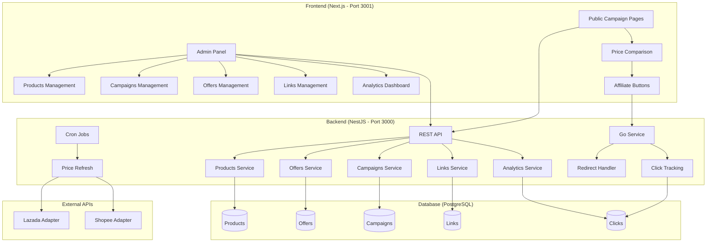
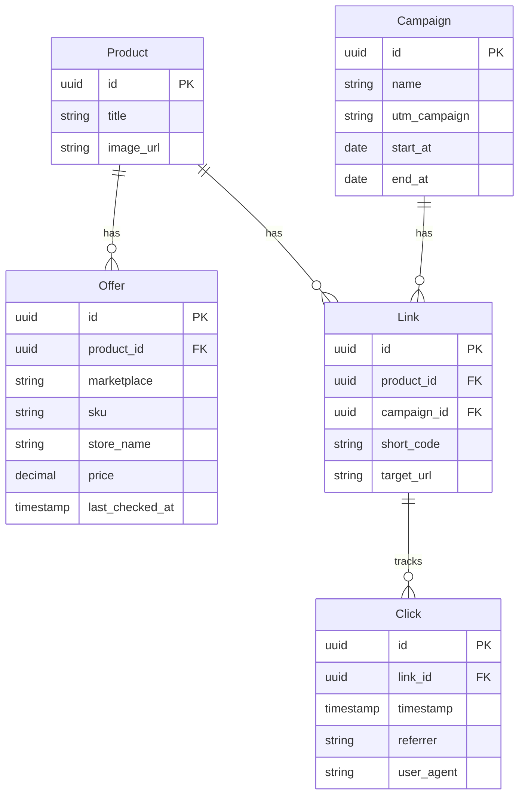

# Affiliate Web App

A full-stack affiliate marketing platform for price comparison and link tracking across Lazada and Shopee marketplaces.

## 🚀 Quick Start

### Prerequisites
- Node.js 18+
- PostgreSQL 14+
- npm or yarn

### Setup Instructions

1. **Clone and Install**
```bash
git clone <repository-url>
cd affiliate

# Install all dependencies (monorepo)
npm install
```

2. **Database Setup**
```bash
# Start PostgreSQL (using Docker)
cd apps/infra
docker-compose up -d

# Run migrations (from root)
npm run migration:run
```

3. **Environment Configuration**

Create `apps/api/.env`:
```env
DB_HOST=localhost
DB_PORT=5432
DB_USER=postgres
DB_PASSWORD=password
DB_NAME=affiliate_db
```

Create `apps/web/.env.local`:
```env
NEXT_PUBLIC_API_URL=http://localhost:3000
```

4. **Start Development Servers**
```bash
# Start both servers concurrently
npm run dev

# Or start individually:
# Backend only (Port 3000)
npm run dev:api

# Frontend only (Port 3001)
npm run dev:web
```

5. **Access Applications**
- Frontend: http://localhost:3001
- Backend API: http://localhost:3000
- Admin Panel: http://localhost:3001/admin

## 📁 Monorepo Structure

```
affiliate/
├── apps/
│   ├── api/          # NestJS backend application
│   ├── web/          # Next.js frontend application
│   └── infra/        # Docker infrastructure
├── package.json      # Root package.json with workspaces
├── .gitignore        # Root gitignore
└── README.md         # This file
```

### Workspace Commands

```bash
# Install dependencies for all workspaces
npm install

# Run scripts in specific workspace
npm run <script> --workspace=apps/api
npm run <script> --workspace=apps/web

# Run scripts in all workspaces
npm run <script> --workspaces

# Add dependency to specific workspace
npm install <package> --workspace=apps/api
```

## 🏗️ Architecture Overview



## 🛠️ Tech Stack & Reasoning

### Backend (NestJS)
- **NestJS**: Enterprise-grade Node.js framework with TypeScript, decorators, and dependency injection
- **TypeORM**: Type-safe database operations with migrations and relationships
- **PostgreSQL**: Robust relational database for complex queries and data integrity
- **Class Validator**: Request validation with decorators
- **Cron Jobs**: Automated price updates using `@nestjs/schedule`

### Frontend (Next.js)
- **Next.js 15**: React framework with App Router for SSR and optimal performance
- **TypeScript**: Type safety across the entire application
- **Tailwind CSS**: Utility-first CSS for rapid UI development
- **Server Components**: Better performance and SEO for public pages

### Key Design Decisions

1. **Modular Architecture**: Separate modules for each domain (Products, Campaigns, Links, etc.)
2. **URL-based Marketplace Detection**: No extra database columns needed
3. **Single API for Product Creation**: Create products with multiple offers in one request
4. **Embedded Analytics**: Click tracking built into redirect flow
5. **Mock Adapters**: Simulate marketplace APIs for development

## 📊 Database Schema



## 🔄 Core Features

### 1. Product & Price Management
- Add products with multiple marketplace offers
- Automatic price fetching from mock adapters
- Hourly price refresh via cron jobs
- Best price highlighting

### 2. Campaign Management
- Create marketing campaigns with UTM parameters
- Date-based campaign scheduling
- Campaign-specific landing pages

### 3. Affiliate Link Generation
- Short link generation with tracking
- UTM parameter injection
- Marketplace-specific targeting

### 4. Analytics & Tracking
- Click tracking with referrer data
- Performance metrics by product/campaign/marketplace
- Real-time dashboard with statistics

### 5. Public Landing Pages
- Price comparison displays
- Marketplace-specific buy buttons
- Responsive design for all devices

## 🚦 API Endpoints

### Products
- `GET /api/products` - List all products with offers
- `POST /api/products` - Create product with offers
- `GET /api/products/:id/offers` - Get product offers

### Campaigns
- `GET /api/campaigns` - List campaigns
- `POST /api/campaigns` - Create campaign
- `GET /api/campaigns/:id` - Get campaign with products

### Links
- `POST /api/links` - Generate affiliate link
- `GET /api/links` - List all links

### Analytics
- `GET /api/dashboard` - Get performance statistics

### Tracking
- `GET /go/:shortCode` - Redirect and track click

## 🔮 Future Roadmap

### Short Term (1-2 weeks)
- [ ] **Real API Integration**: Replace mock adapters with actual Lazada/Shopee APIs
- [ ] **User Authentication**: Admin login and role-based access
- [ ] **Link Expiration**: Time-based link deactivation
- [ ] **Bulk Operations**: Import/export products via CSV

### Medium Term (1-2 months)
- [ ] **Advanced Analytics**: Conversion tracking, revenue attribution
- [ ] **A/B Testing**: Campaign performance optimization
- [ ] **Email Notifications**: Price drop alerts, campaign reports
- [ ] **Mobile App**: React Native companion app

### Long Term (3-6 months)
- [ ] **Multi-tenant**: Support multiple affiliate programs
- [ ] **Machine Learning**: Price prediction, demand forecasting
- [ ] **API Rate Limiting**: Prevent abuse and ensure stability
- [ ] **CDN Integration**: Global content delivery for images
- [ ] **Webhook System**: Real-time integrations with external systems

### Performance & Scalability
- [ ] **Redis Caching**: Cache frequently accessed data
- [ ] **Database Optimization**: Query optimization and indexing
- [ ] **Microservices**: Split into domain-specific services
- [ ] **Load Balancing**: Handle high traffic volumes
- [ ] **Monitoring**: Application performance monitoring (APM)

### Security Enhancements
- [ ] **Rate Limiting**: Prevent API abuse
- [ ] **Input Sanitization**: XSS and injection prevention
- [ ] **HTTPS Enforcement**: Secure all communications
- [ ] **Audit Logging**: Track all admin actions

## 🧪 Testing

```bash
# Run all tests
npm run test

# Or run tests for specific apps:
npm run test --workspace=apps/api
npm run test --workspace=apps/web
```

## 📝 License

MIT License - see LICENSE file for details

## 🤝 Contributing

1. Fork the repository
2. Create feature branch (`git checkout -b feature/amazing-feature`)
3. Commit changes (`git commit -m 'Add amazing feature'`)
4. Push to branch (`git push origin feature/amazing-feature`)
5. Open Pull Request

---

**Built with ❤️ for affiliate marketers**